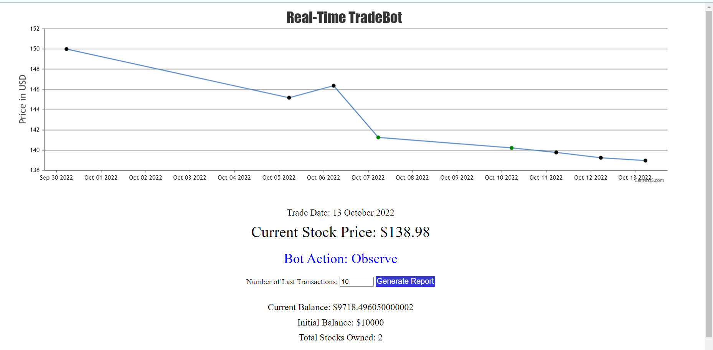

This is a simple stock trading application that uses a bot to analyze stock data and make predictions. 
Features:
- [x] Periodically Fetches stock data from the Polygon.io API
- [x] Analyzes stock data and predicts whether to buy, sell, or observe (Bot activity)
- [x] Allows users to view stock data and latest predictions by the bot
- [x] Represents a dynamic chart of stock data and the actions made based on predictions. Each point on chart represents a stock transaction. (:red_circle: - Sell, :green_circle: - Buy, :black_circle: - Observe)
- [x] Generates a report of stock transactions for a given number of transactions (CSV file)

## Tech Stack
- Frontend
  - HTML
  - CSS
  - JavaScript
  - Chart.js
- Backend
  - Node.js
  - Express.js
  - MongoDB

## Installation and Setup
1. Clone the repository
2. Install dependencies: `npm install`
3. Create a `.env` file in the root directory and add the following environment variables:
   - `MONGODB_URI`: MongoDB connection string
   - `POLYGON_API_KEY`: Polygon.io API key
4. Start the application: `npm start`
5. Open a browser and navigate to `http://localhost:3000`

## Specifications and assumptions
- The bot makes predictions based on the stock data fetched from the Polygon.io API. (Data starts from October-2022). Data is fetched reguarly after 21 seconds (just to prevent the API rate limit).
- Price of for each day is averaged from the high and low prices.
- The bot predicts whether to buy, sell, or observe based on the price trend. Final decision to process the transcation depends on availabe balance and stocks owned.

## Routes
| Route              | Method | Description                                                      | Controller Function                         | Query Parameters             |
|--------------------|--------|------------------------------------------------------------------|--------------------------------------------|------------------------------|
| `/report`          | `GET`  | Generates a report for a given number of transactions.           | `handleGenerateReport(req, res, num)`      | `num`: Number of transactions |
| `/`                | `GET`  | Serves the home page of the application.                         | `handleGetHome(req, res)`                  | None                         |
| `/stock/fetch-new` | `GET`  | Fetches new stock data and latest predictions by the bot.        | `handleFetchNewRequest(req, res)`          | None                         |
| `/stock/fetch-all` | `GET`  | Fetches all stock data, including historical data and predictions.| `handleFetchAllRequest(req, res)`          | None                         |

## Controllers

| Controller      | Function                     | Description                                                      | Parameters                     | Return                            |
|------------------|------------------------------|------------------------------------------------------------------|--------------------------------|-----------------------------------|
| `report.js`      | `handleGenerateReport`       | Generates a report of stock transactions for a given number.     | `req`, `res`, `num`           | CSV file containing transaction data |
| `static.js`      | `handleGetHome`              | Renders the home page of the application.                        | `req`, `res`                  | Renders the home view            |
| `stock.js`       | `handleFetchNewRequest`      | Fetches new stock data and updates their status.                | `req`, `res`                  | JSON with new stock data         |
| `stock.js`       | `handleFetchAllRequest`      | Fetches all stock data and returns the latest transactions.      | `req`, `res`                  | JSON with all stock data         |
| `stock.js`       | `processTransaction`         | Processes a stock transaction based on predictions and balance.  | `stockData`                   | Creates a new stock entry in DB  |
| `stock.js`       | `fetchAvailableBalanceAndStocksHeld` | Retrieves the current balance and stocks owned.              | None                           | Object with balance and stocks    |

## Models
The `STOCK` model stores each stock transaction. This data is accessed during report generation, transaction processing, and updating the frontend.

| Field              | Type     | Description                                      |
|--------------------|----------|--------------------------------------------------|
| `stockSymbol`      | String   | The symbol of the stock (e.g., AAPL, TSLA).    |
| `stockPrice`       | Number   | The price of the stock at the time of the transaction. |
| `tradeAction`      | String   | The action taken: 'buy', 'sell', or 'observe'.  |
| `isNewStock`       | Boolean  | Indicates if the stock is new (default: true).  |
| `tradeDate`        | Date     | The date of the transaction (defaults to the current date). |
| `availableBalance`  | Number   | The available balance after the transaction.     |
| `stocksOwned`      | Number   | The number of stocks owned after the transaction (default: 0). |

### Timestamps
The model includes timestamps for `createdAt` and `updatedAt`, which are automatically managed by Mongoose.

## Services

| Service             | Function                            | Description                                                      | Parameters                 | Return                                    |
|---------------------|-------------------------------------|------------------------------------------------------------------|----------------------------|-------------------------------------------|
| `bot.js`            | `analyzeStock`                      | Analyzes stock data and predicts whether to buy, sell, or observe. | `data`                     | Prediction string ('buy', 'sell', or 'observe') |
| `connectToDB.js`    | `connect`                           | Connects to MongoDB and initializes the database with a dummy entry. | `url`                      | Promise that resolves when connected or rejects on error |
| `fetchLiveData.js`  | `fetchStockData`                   | Fetches stock data from the Polygon.io API for a given ticker.  | `ticker`                   | Stock data object from the API or null on error |
| `fetchLiveData.js`  | `processStockData`                 | Processes fetched stock data to extract relevant information.    | `data`                     | Processed result object or default 'N/A' object |
| `fetchLiveData.js`  | `fetchDataAndProcess`              | Combines fetching and processing stock data.                     | `ticker`                   | Result object from processing function    |
| `fetchLiveData.js`  | `startFetchingStockDataAndAnalyse` | Starts a periodic fetch and analysis of stock data.              | `ticker`                   | None (initiates a setInterval function)  |
